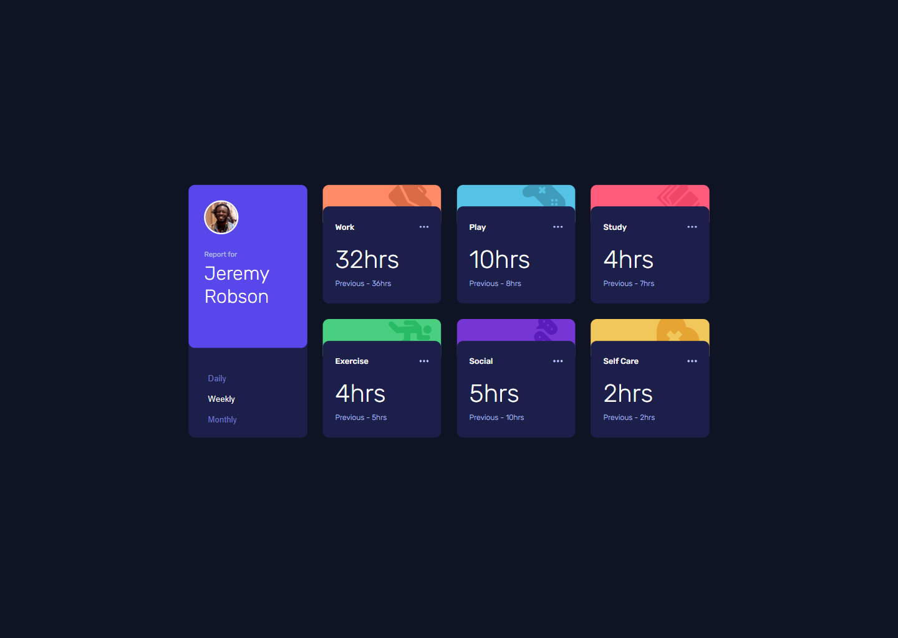
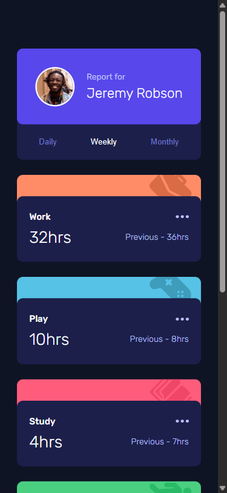

# Frontend Mentor - Time tracking dashboard solution

This is a solution to the [Time tracking dashboard challenge on Frontend Mentor](https://www.frontendmentor.io/challenges/time-tracking-dashboard-UIQ7167Jw). Frontend Mentor challenges help you improve your coding skills by building realistic projects.

## Table of contents

- [Overview](#overview)
  - [The challenge](#the-challenge)
  - [Screenshot](#screenshot)
  - [Links](#links)
- [My process](#my-process)
  - [Built with](#built-with)
  - [What I learned](#what-i-learned)
- [Author](#author)

## Overview

### The challenge

Users should be able to:

- View the optimal layout for the site depending on their device's screen size
- See hover states for all interactive elements on the page
- Switch between viewing Daily, Weekly, and Monthly stats

### Screenshot

#### Desktop

#### Mobile

### Links

- Solution URL: [Frontend Mentor](https://www.frontendmentor.io/solutions/time-tracking-dashboard-2G9e4U613s)
- Live Site URL: [GitHub Page](https://anhvu1012.github.io/Time-tracking-dashboard/)

## My process

### Built with

- Semantic HTML5 markup
- CSS custom properties
- Flexbox
- CSS Grid
- Mobile-first workflow
- [SASS](https://sass-lang.com/) - For styles

### What I learned

It was my very first experience working with SASS. The syntax was easy to learn and it really helps me break down the long styles.scss main file creating a clear styling structure.

Furthermore, I could practice working with data and asynchronous functions. Also I learned how to fetch data from a JSON file and populate them in the DOM.

I am most proud of the SCSS files structure :D

## Author

- Frontend Mentor - [@anhvu1012](https://www.frontendmentor.io/profile/anhvu1012)
